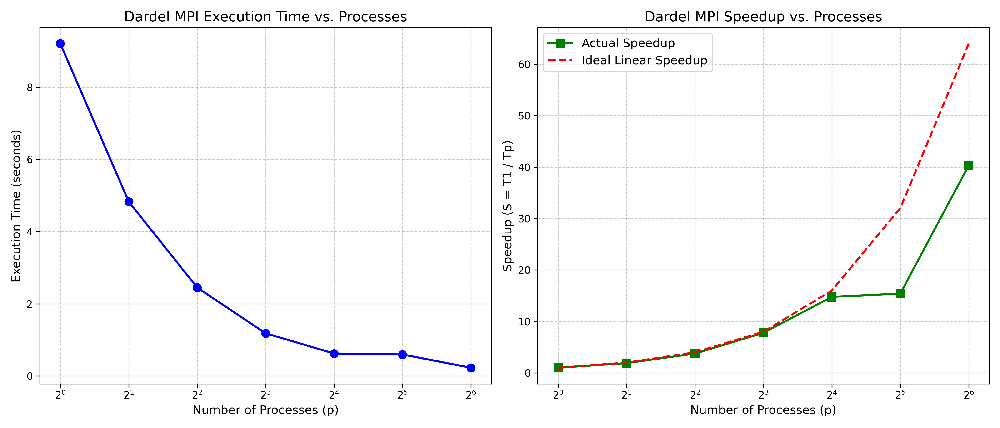
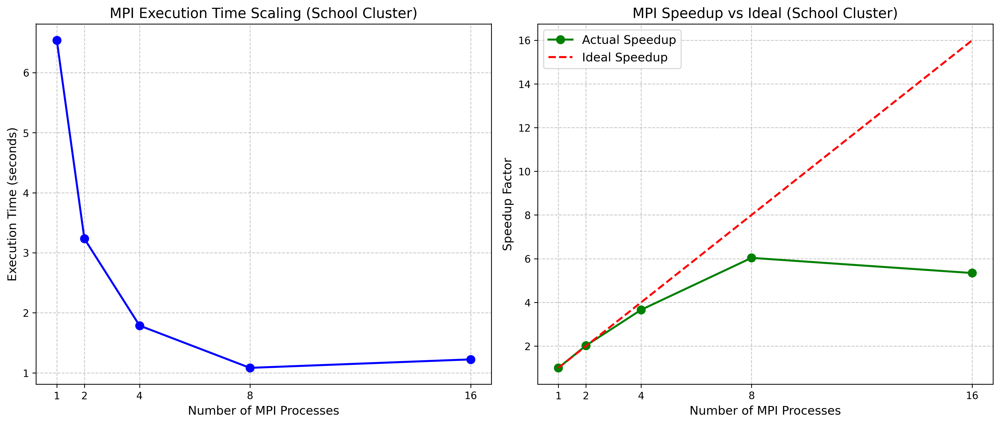

# DD2356-Project-Electromagnetic
This application simulates electromagnetic wave propagation using the Finite-Difference Time-Domain (FDTD) method.

## Electromagnetics Test Case for Correctness

### Test Case Description

*   **Initial Condition:**
    The electric field is initialized with a Gaussian pulse centered at $x = NX \times DX/2$, while the magnetic field starts at zero.

*   **Expected Behavior:**
    With simple absorbing boundaries, the Gaussian pulse should split into two pulses that propagate outward at the numerical speed determined by the CFL condition. For our parameters:

    *   **Propagation Speed:** The wave speed is approximately $c \approx DX/DT$ (typically normalized to 1 in a properly scaled FDTD simulation).
    *   **Pulse Displacement:** After NSTEPS time steps, the peak of the pulse is expected to have shifted by roughly $NSTEPS/2$ grid points in each direction.

### Verification Steps

1.  **Visual Inspection:**
    Plot the electric field $E(x)$ at various time steps (e.g., $t = 0, t = NSTEPS/2, t = NSTEPS$). Confirm that the Gaussian pulse splits into two symmetric pulses propagating in opposite directions.

    For this, we decided to modify the serial code in order to save the electric field on 10 instances inside a matrix. After the computation finishes, we are writting the results to files inside `data_for_plotting/serial`. Afterwards, we are plotting the data using `visualize.py`. The picture will be saved inside `plots` folder.

    ```bash
    gcc originalC.c -o originalC -lm
    ./originalC
    python visualize.py
    ```

2.  **Peak Position Check:**
    Determine the index of the maximum electric field at the final time step. Compare this position with the expected shift from the initial center.

    For this, reference the folder `artifacts_for_testing`. File `originalC_big_vector.c`. For this, we inputed the field being a lot larger than the distance that the wave is meant to travel. If the wave would hit a wall, it would be "reflected". Hence, `artifacts_for_testing.c` can be compiled, and ran and show the serial sanity check. We kept it as an artifact, as, if we decreased the size of the vector for later testing purpopses, we couldn't compute the peak position from math.

    ```bash
    gcc artifacts_for_testing/originalC_big_vector.c -o originalC_big_vector -lm
    ./originalC_big_vector
    ```

3.  **Quantitative Comparison:**
    Optionally, calculate the relative error between the simulated peak amplitude and a reference solution (analytical or from a validated simulation). The error should remain within acceptable bounds (e.g., less than 5%) for a proper CFL setting.

    It can be seen in the aforementioned file, the compilation and running steps. The results are the same for both methods. In case they will no longe rbe the same, `originalC_big_vector.c` will compute the relative error `abs(right_val - rong_val)/right_val`.

## Project Plan & Logistics

### 📋 Tasks Chosen
*   **Baseline:** Validate serial code, profile performance, estimate speedup bounds.
*   **OpenMP:** Parallelize E/H updates, analyze scalability and overhead.
*   **MPI:** Domain decomposition, halo exchange, strong/weak scaling.
*   **Hybrid MPI+OpenMP:** Tune (P, N), analyze scalability for fixed cores.
*   **Optimization:** Address bottlenecks, improve memory access, GPU offloading.

### ⚠️ Challenges
*   Data dependencies between E and H updates.
*   MPI communication overhead (halo exchange).
*   Memory bandwidth limitation (stencil-like pattern).
*   Hybrid tuning complexity.
*   GPU data transfer overhead.

### 📅 Timeline

| Phase | Focus Area |
| :--- | :--- |
| **Week 1** | Baseline, profiling, correctness |
| **Week 2** | MPI + OpenMP implementation |
| **Week 3** | Optimization, vectorization |
| **Week 4** | Scaling tests, evaluation |

### 👥 Responsibilities
*   **Hieu:** OpenMP, plotting
*   **Serban:** MPI, correctness
*   **Teddy:** Optimization, profiling

### Baseline C/C++ Implementation

1. **Identify useful metrics for performance profiling and present their measurement on the 3 computing systems**
    - **Personal Computer**
        - First of all, compilation, with specification of size
            ```bash
            gcc originalC.c -o originalC -lm -O0 -DNX=400 -DNSTEPS=1000
            ```
        - By keeping a way too low matrix size:
            - **time**
                ```bash
                time ./originalC
                real	0m0.005s
                user	0m0.004s
                sys	0m0.001s
                ```
            - **perf**
                For the perf stat, we used first:
                ```bash
                sudo perf stat -e cache-misses,cache-references,L1-dcache-loads,L1-dcache-load-misses,cycles,instructions ./originalC
                119,053      cache-misses                     #   49.96% of all cache refs           (18.72%)
                238,309      cache-references                                                        (47.08%)
                7,212,485      L1-dcache-loads                                                         (75.45%)
                    8,864      L1-dcache-load-misses            #    0.12% of all L1-dcache accesses   (81.28%)
                7,832,944      cycles                                                                  (52.92%)
                34,099,260      instructions                     #    4.35  insn per cycle              (24.55%)
                ```
                2 vectors of 400 doubles, which is around 6KB, hence all of it fits inside L1 cache, hence low L1 cache misses. The first cache missses are form LLC. But we can see that the code is staying inside L1, so probably from startup. The 4.35 insn per cycle means that the code is getting pipelined (as it would have maximum 5). We decided against vector operations at this stage, as they are not the purpose of this assignment (-O0).

                Now let's look over the memory accessed:
                ```c
                E[i] = E[i] + (DT / DX) * (H[i] - H[i - 1]);
                H[i] = H[i] + (DT / DX) * (E[i + 1] - E[i]);
                ```
                From what we can see, there are 2 writes, and 4 reads
                `6 * 400 * 1000 * 8bytes = 19.2MB of data accessed in 0.005 seconds -> 3.8GB/s

                ```bash
                sudo perf stat -e branch-instructions,branch-misses ./originalC
                1,082,922      branch-instructions                                                   
                36,286      branch-misses                    #    3.35% of all branches      
                ```

                Not too many branch misses, as it is computed only when we are in the for loop

                ```bash
                sudo perf stat -e dTLB-loads,dTLB-load-misses,dTLB-stores,dTLB-store-misses ./originalC
                2,648      dTLB-loads                                                            
                789      dTLB-load-misses                 #   29.80% of all dTLB cache accesses
                ```

                Yeah, that is quite some bad performance. In a page, there is like 4KB. that means that there should be a page miss every like 512 times.
                Might be due to the program size and the startup cost.
            - perf hotspots
            
            | Self % | Total % | Command | Symbol |
            |---|---|---|---|
            | 76.91% | 0.00% | originalC | main |
            | 44.48% | 41.08% | originalC | update_E |
            | 32.55% | 32.55% | originalC | update_H |
            So, as we can see, the update function take most of the time

    - **Big Boy Dardel**
        - First of all, compilation, with specification of size
            ```bash
            cc originalC.c -o originalC -lm -O0 -DNX=400 -DNSTEPS=1000
            ```
            one could also run
            ```bash
            sbatch ./running_scripts_profile_lapt.sh
            ```
        - By keeping a way too low matrix size:
            - **time**
                ```bash
                time ./originalC
                real	0m0.008s
                user	0m0.003s
                sys	0m0.004s

                ```
            - **perf**
                For the perf stat, we used first:
                ```bash
                sudo perf stat -e cache-misses,cache-references,L1-dcache-loads,L1-dcache-load-misses,cycles,instructions ./originalC
                    26,581      cache-misses:u                   #   21.347 % of all cache refs    
                124,521      cache-references:u                                                 
                14,799,274      L1-dcache-loads:u                                                  
                    20,959      L1-dcache-load-misses:u          #    0.14% of all L1-dcache accesses
                13,040,683      cycles:u                                                           
                22,248,016      instructions:u                   #    1.71  insn per cycle        
                ```
                Similar results as personal computer. Only difference is that insn is very low. Seems like dardel doesn't do optimiations automatically

                Now let's look over the memory accessed:
                ```c
                E[i] = E[i] + (DT / DX) * (H[i] - H[i - 1]);
                H[i] = H[i] + (DT / DX) * (E[i + 1] - E[i]);
                ```
                From what we can see, there are 2 writes, and 4 reads
                `6 * 400 * 1000 * 8bytes = 19.2MB of data accessed in 0.008 seconds -> 2.4GB/s

                ```bash
                sudo perf stat -e branch-instructions,branch-misses ./originalC
                2,439,158      branch-instructions:u                                              
                26,754      branch-misses:u                  #    1.10% of all branches        

                ```
                Not too many branch misses, as it is computed only when we are in the for loop

                ```bash
                sudo perf stat -e dTLB-loads,dTLB-load-misses,dTLB-stores,dTLB-store-misses ./originalC
                13,768      dTLB-loads:u                                                       
                2,019      dTLB-load-misses:u               #   14.66% of all dTLB cache accesses
                ```
                There are significantly more pages accessed that on the PC. hence less dTLB cache misses rates. 
            - perf hotspots
            
            | Self % | Total % | Command | Symbol |
            |---|---|---|---|
            | 76.91% | 0.00% | originalC | main |
            | 44.48% | 41.08% | originalC | update_E |
            | 32.55% | 32.55% | originalC | update_H |
            So, as we can see, the update function take most of the time
            - chache grind
            ```bash
            ==2571594== I   refs:      22,425,686
            ==2571594== I1  misses:         2,705
            ```
            Very low instruciton misses.
            ```bash
            ==2571594== D   refs:      14,479,315  (12,444,878 rd   + 2,034,437 wr)
            ==2571594== D1  misses:        39,176  (    33,789 rd   +     5,387 wr)
            ==2571594== LLd misses:        20,916  (    17,050 rd   +     3,866 wr)
            ==2571594== D1  miss rate:        0.3% (       0.3%     +       0.3%  )
            ==2571594== LLd miss rate:        0.1% (       0.1%     +       0.2%  )
            ```
            We can see preciselly the number of reads and writes that are being done (which is as we computed, 6 * 8 * 400 * 1000).

    - **School Cluster**
        - First of all, compilation, with specification of size
            ```bash
            cc originalC.c -o originalC -lm -O0 -DNX=400 -DNSTEPS=1000
            ```
        - At the same, time, one could also just run
            ```bash
            ./running_scripts_profile_lapt.sh
            ```

        - By keeping a way too low matrix size:
            - **time**
                ```bash
                time ./originalC
                real    0m0.003s
                user    0m0.003s
                sys     0m0.000s
                ```
            - **perf**
                For the perf stat, we used first:
                ```bash
                sudo perf stat -e cache-misses,cache-references,L1-dcache-loads,L1-dcache-load-misses,cycles,instructions ./originalC
                    14030      cache-misses              #   63.671 % of all cache refs    
                    22035      cache-references                                            
                11655339      L1-dcache-loads                                             
                    12065      L1-dcache-load-misses     #    0.10% of all L1-dcache accesses
                8511330      cycles                                                      
                28079302      instructions              #    3.30  insn per cycle        
                ```
                Over here there is something interesting. For the personal computer the initial cache loading for LLC took the longest. probably due to the lack of optimizations. For the amount of insn, it is decent

                Now let's look over the memory accessed:
                ```c
                E[i] = E[i] + (DT / DX) * (H[i] - H[i - 1]);
                H[i] = H[i] + (DT / DX) * (E[i + 1] - E[i]);
                ```
                From what we can see, there are 2 writes, and 4 reads
                `6 * 400 * 1000 * 8bytes = 19.2MB of data accessed in 0.003 seconds -> 5.8GB/s

                ```bash
                sudo perf stat -e branch-instructions,branch-misses ./originalC
                1138525      branch-instructions                                         
                9059      branch-misses             #    0.80% of all branches       
                ```

                Not too many branch misses, as it is computed only when we are in the for loop

                ```bash
                sudo perf stat -e dTLB-loads,dTLB-load-misses,dTLB-stores,dTLB-store-misses ./originalC
                11658172      dTLB-loads                                                  
                1076      dTLB-load-misses          #    0.01% of all dTLB cache accesses
                ```

                Amazing result for the cache loads and misses. Or not. I suppose that for some reason there are a lot of page lookups getting done (maybe other background processes?).
            - perf hotspots
            
            | Overhead | Self | Binary | Symbol | Function |
            |----------|------|--------|--------|----------|
            | 62.70% | 0.00% | originalC | originalC | main |
            | 43.33% | 43.33% | originalC | originalC | update_E |
            | 19.37% | 19.37% | originalC | originalC | update_H |
            
            So, as we can see, the update functions take most of the time


2. **Identify useful metrics for performance profiling and present their measurement on the 3 computing systems With bigger Problem size**
    - **Personal Computer**
        - First of all, compilation, with specification of size
            ```bash
            gcc originalC.c -o originalC -lm -O0
            ```
        - By keeping a way too low matrix size:
            - **time**
                ```bash
                time ./originalC
                real	0m5.767s
                user	0m5.762s
                sys	0m0.004s

                ```
            - **perf**
                For the perf stat, we used first:
                ```bash
                sudo perf stat -e cache-misses,cache-references,L1-dcache-loads,L1-dcache-load-misses,cycles,instructions ./originalC
                21,641,634      cache-misses                     #    1.33% of all cache refs           (50.00%)
                1,632,026,269      cache-references                                                        (50.00%)
                28,995,750,517      L1-dcache-loads                                                         (50.00%)
                806,805,279      L1-dcache-load-misses            #    2.78% of all L1-dcache accesses   (50.00%)
                23,856,689,210      cycles                                                                  (50.00%)
                105,676,455,719      instructions                     #    4.43  insn per cycle              (50.00%)

                ```
                The amount of L1 data cache misses is preety high:
                `E + H = 2 × 80000 × 8 bytes = 1.28 MB`
                `80000 elements / 8 doubles per cache line = 10,000 cache line loads per array`
                `2 arrays × 10,000 = 20,000 misses per step`
                `20,000 × 20,000 steps = 400,000,000 L1 misses`
                There are 2 functions for updating the E and the H, so it is expectable. 
                The insn is the same as before.


                Now let's look over the memory accessed:
                ```c
                E[i] = E[i] + (DT / DX) * (H[i] - H[i - 1]);
                H[i] = H[i] + (DT / DX) * (E[i + 1] - E[i]);
                ```
                From what we can see, there are 2 writes, and 4 reads
                `6 * 80000 * 20000 * 8bytes = 71.2BB of data accessed in 5.7 seconds -> 14GB/s`

                ```bash
                sudo perf stat -e branch-instructions,branch-misses ./originalC
                3,216,589,013      branch-instructions                                                   
                1,898,515      branch-misses                    #    0.06% of all branches     
                ```

                Not too many branch misses, as it is computed only when we are in the for loop

                ```bash
                sudo perf stat -e dTLB-loads,dTLB-load-misses,dTLB-stores,dTLB-store-misses ./originalC
                12,837,658      dTLB-loads                                                            
                    36,878      dTLB-load-misses                 #    0.29% of all dTLB cache accesses
                ```

                Quite some good performance. This makes sense, as pages will get evicted after we go through all their elements (8KB probably, hence a page miss every 1K itertions).
            - perf hotspots

                | Self % | Total % | Command | Symbol |
                |--------|---------|---------|--------|
                | 100.00% | 0.00% | originalC | main |
                | 50.18% | 49.90% | originalC | update_E |
                | 49.97% | 49.67% | originalC | update_H |

            So, as we can see, the update function take most of the time

    - **Big Boy Dardel**
        - First of all, compilation, with specification of size
            ```bash
            cc originalC.c -o originalC -lm -O0
            ```
            one could also run
            ```bash
            sbatch ./running_scripts_profile_lapt.sh
            ```
        - By keeping a way too low matrix size:
            - **time**
                ```bash
                time ./originalC
                real	0m11.264s
                user	0m11.251s
                sys	0m0.008s


                ```
            - **perf**
                For the perf stat, we used first:
                ```bash
                sudo perf stat -e cache-misses,cache-references,L1-dcache-loads,L1-dcache-load-misses,cycles,instructions ./originalC
                    13,175,407      cache-misses:u                   #    0.801 % of all cache refs    
                1,645,551,667      cache-references:u                                                 
                51,222,765,885      L1-dcache-loads:u                                                  
                801,149,907      L1-dcache-load-misses:u          #    1.56% of all L1-dcache accesses
                35,905,756,922      cycles:u                                                           
                70,412,692,558      instructions:u                   #    1.96  insn per cycle         


                ```
                similar results. The insn got higher, which is nice. 
                Now let's look over the memory accessed:
                ```c
                E[i] = E[i] + (DT / DX) * (H[i] - H[i - 1]);
                H[i] = H[i] + (DT / DX) * (E[i + 1] - E[i]);
                ```
                From what we can see, there are 2 writes, and 4 reads
                `6 * 80000 * 20000 * 8bytes = 71.2GB of data accessed in 11.2 seconds -> 6.35GB/s`

                ```bash
                sudo perf stat -e branch-instructions,branch-misses ./originalC
                6,402,988,318      branch-instructions:u                                              
                70,723      branch-misses:u                  #    0.00% of all branches      

                ```

                ```bash
                sudo perf stat -e dTLB-loads,dTLB-load-misses,dTLB-stores,dTLB-store-misses ./originalC
                12,569,313      dTLB-loads:u                                                       
                4,801      dTLB-load-misses:u               #    0.04% of all dTLB cache accesses
                ```
                Amazing amount of page misses. That means that either all the data stays insid ethe cahce (unlikelly), or that the supercomputer has very big pages! 
            - chache grind

    - **School Cluster**
        - First of all, compilation, with specification of size
            ```bash
            cc originalC.c -o originalC -lm -O0
            ```
        - At the same, time, one could also just run
            ```bash
            ./running_scripts/profile_lapt.sh
            ```

        - By keeping a way too low matrix size:
            - **time**
                ```bash
                time ./originalC
                real    0m4.997s
                user    0m4.998s
                sys     0m0.000s
                ```
            - **perf**
                For the perf stat, we used first:
                ```bash
                sudo perf stat -e cache-misses,cache-references,L1-dcache-loads,L1-dcache-load-misses,cycles,instructions ./originalC
                        144280      cache-misses              #    0.637 % of all cache refs    
                    22647819      cache-references                                            
                44805895857      L1-dcache-loads                                             
                    35447031      L1-dcache-load-misses     #    0.08% of all L1-dcache accesses
                18942826723      cycles                                                      
                105621143093      instructions              #    5.58  insn per cycle      
                ```
                Holly pipelining! so, there are 6 steps in the pipeline process, and the school cluster ir using them to their maiximum. Although 44 billions L1 loads??? It is quite fair, cause we have 2 funcitons, where 6 operations are being done, for 20000STEPS for 80000 vector sizes.

                Now let's look over the memory accessed:
                ```c
                E[i] = E[i] + (DT / DX) * (H[i] - H[i - 1]);
                H[i] = H[i] + (DT / DX) * (E[i + 1] - E[i]);
                ```
                From what we can see, there are 2 writes, and 4 reads
                `6×2×80000×20000 * 8bytes = 143GB of data accessed in 5 seconds -> 28GB/s

                ```bash
                sudo perf stat -e branch-instructions,branch-misses ./originalC
                3204437800      branch-instructions                                         
                    82452      branch-misses             #    0.00% of all branches       
                ```

                Not too many branch misses, as it is computed only when we are in the for loop

                ```bash
                sudo perf stat -e dTLB-loads,dTLB-load-misses,dTLB-stores,dTLB-store-misses ./originalC
                44806070655      dTLB-loads                                                  
                4621      dTLB-load-misses          #    0.00% of all dTLB cache accesses
                ```

                Top notch result once again. Might attribute that to the os doing prefetching of pages, so that the next ones will be automatically in memory. Because, if a page is 2MB (already huge), and we have around 2K entries for the TLB. So, for 4GB of data, but we are using 140GB. So, we will start deleting 2MB pages. We should have more TLB misses, prefetching is being done.


3. **Approximate the upper bound of parallel speedup**
    For the upper bound of parallel speedup let's look at the version that is Nx = 400 and STEP 1000:
    ```bash
    Allocation time: 0.000016 seconds
    Initialization time: 0.000015 seconds
    Saving time: 0.000087 seconds
    Main loop time: 0.001810 seconds
    Verification time: 0.000040 seconds
    ```
    The initialization time and main loop time are completelly paralelizable, that would mean that the fraction of code that is serial is
    f = (0.000016 + 0.000087 + 0.000040) / 0.001968 = 0.073

    Hence, the upper bound of parallel speedup is 1/f = 13.69. This means that we cannot expect to have a speedup bigger than 13.69, even if we have infinite threads.

    Now for NX = 80000 and STEP = 20000:
    ```bash
    Allocation time: 0.000039 seconds
    Initialization time: 0.002310 seconds
    Saving time: 0.000248 seconds
    Main loop time: 5.737972 seconds
    Verification time: 0.000429 seconds
    ```
    The initialization time and main loop time are completelly paralelizable, that would mean that the fraction of code that is serial is
    f = (0.000039 + 0.000248 + 0.000429) / 5.740688 = 0.000122

    Hence, the upper bound of parallel speedup is 1/f = 8196.72. This means that we can expect to have a very good speedup, as the fraction of code that is serial is very low.


    
### OpenMP 
1. **Identify compute-intensive parts and implement OpenMP parallelization**
    In order to identify compute-intensive parts, we need to look statically first.

    First of all, we have the `initialize_fields()` function that initializes `Nx` data points. This is done in O(N), where N is Nx.

    The main loop of the code is
    ```c
    for (int t = 0; t < NSTEPS; t++) {
        update_H(E, H);
        update_E(E, H);
    }
    ```
    With `update_H` and `update_E` being composed of a single for loop that is computationally expensive
    ```c
    for (int i = 0; i < NX - 1; i++) 
        H[i] = H[i] + (DT / DX) * (E[i + 1] - E[i]);
    ```

    The time complexity of this operation is O(Nx * Nsteps). Both of them being bigger than 1K. Hence, in the for loops where we are using NPLOTTINGS, we can directly ignore it and consider it a constant.

    The last part
    ```c
    // for each of the steps, open a file to write them
    for (int i = 0; i < NPLOTTINGS; i++)
        for (int j = 0; j < NX; j++)
            fprintf(out_file, "%f ", E_at_timestep[i][j]);
    ```
    is going to have an overhead that is pretty big, given that opening multiple files and writing inside them linearly is costly.

    Another solution would have been to write on every iteration of the main loop, which is unacceptable.
    
    Now, let's use some tooling to see the computationally expensive parts.

    ```bash
    gcc -g -O0 originalC.c -o originalC -lm
    perf record -g ./originalC
    perf report
    ```

    The result was:

    | Function | Percentage |
    |----------|------------|
    | main | 96.74% |
    | fprintf | 54.30% |
    | update_E | 16.84% |
    | update_H | 15.53% |
    | fclose | 3.78% |
    | printf | 1.30% |
    | fopen | 1.25% |

    Most of the time is being spent writing to file, so let's increase the Nx and the number of steps

    | Function | Percentage |
    |----------|------------|
    | main | 99.76% |
    | update_E | 46.68% |
    | update_H | 46.15% |
    | fprintf | 6.36% |

    This is better. This would mean that the minimum amount of time that we could occupy afterwards would be 10%.

    After some modifications to the c code (some precompilation techniques that can hide the printf functions), we got rid of the 
    printf time. We put some precompilation techniques in order to hide the printf. Now most of the compute time will be used by the electric and magnetic flux functions.

    Now, we can implement the openMP paralelization. As we can see, there is a data dependency. First of all, update__E depends on update_H (vector E depends on vector H). If at step i, vector E is updated, then at step i + 1, vector H will be updated based on vector E. So, we cannot paralelize the step for loop. 

    By looking at the update_E function:
    ```c
    for (int i = 1; i < NX; i++) {
        E[i] = E[i] + (DT / DX) * (H[i] - H[i - 1]);
    }
    ```
    We can see that it is very easy to paralelize it. We can use as many threads as there are elements inside the vector (or 4 times less threads and also use vector registers). 
    ```c
    #pragma omp parallel for schedule(static)
    for (int i = 0; i < NX - 1; i++)
    ```
    We are using static as all operations take the same amount of time, on average all threads will finish simultaneously (on a supercomputer on a node that does only this).

    so, for running the program, one can do:

    ```bash
    gcc -fopenmp openMP_v1.c -o openMP_v1 -lm -DTHREAD_COUNT=16
    ./openMP_v1
    ```
2. **Verify the correctness of implementation**
    For printing the output, the flag `-DENABLE_PLOTTING` needs to be added. This will save the electric field in 50 instances. Afterwards the plotting script can be ran, which will save the plot in `plots/field_plot_omp.png`.

    ```bash
    gcc -fopenmp openMP_v1.c -o openMP_v1 -lm -DTHREAD_COUNT=16 -DENABLE_PLOTTING
    ./openMP_v1
    python visualize.py
    ```

    We can see that we have the same result. This can be seen either by looking at the plot, or by reading the expected position and the actual position (the relative error), which is the same for the serial and the omp versions:

    ```bash
    Expected position of the maximum electric field: 50000.000000
    Actual position of the maximum electric field: 49994.000000
    The maximum electric field is NOT at the expected position.
    Relative error: 0.012000%
    ```
    Hence, it is correct.

3. **Model the inter-thread communication overhead and analyze how it may affect scalability**

    It is known that the computation time in the serial version is 

    T_serial = T_compute

    In the parallel version, we have:

    T_parallel = T_compute / P + T_overhead

    where P is the number of threads, and T_overhead is the time spent on inter-thread communication, synchronization and coherence cost (didn't know how this was called but Gemini helped me, or hallucinated hehe).

    inter-thread communication is done through the cache lines. So, whenever a thread is writting to a cache line, it is pulling it from the memory and blocking other thread's access to it.
    Whenever a core is writting to a cache line that is shared (multiple cores are working on the same data taken from L3), it is in fact trying to write to a copy it has in L1. Before it can do that, it sends a request for ownership to the other cores. Hence, if other cores were reading or tryint to write to that data, then they would have to flush and wait for the changes. This is what happens behind false sharing. This is the cost of coherence. A good thing is that in this case we don't have any inter-thread communication cost, and only have synchronization cost.

    **Synchronization cost**
    The syncrhonization cost for pragma omp for is the barrier in the end (as all threads have to finish before the next iteration).
    
    The serial code is taking approximatelly 5.3 seconds.
    That would mean, that with 8 threads running at the same time, the new hypotethical time would be 5.3/8 = 0.66 seconds.
    The time it takes the openMP version is around 0.865 seconds on averge. That would mean that the overhead is of around 0.2 seconds.
    This overhead comes from creating and deleting threads multiple times. It comes from the barriers that are at every `#pragma parallel for loop`.

    **How would it affect scalability?**

    This overhead will be a big problem for the increasing number of steps. At each step, the threads and barriers are created. With the increase of NX, the overhead will remain constant, as all threads intersect in the cache the same amount of times. Also, they spawn the same number of times. The only problem would be if some threads are slower than others and will finish a lot faster, but for this a `schedule(guided)` will sove it.
    We also tested how it would be to create all the threads a single time and use them afterwards

    **Regarding other implementations for OpenMP**
    We also tried multiple variants for the program. we tried spawning all the threads a single time, as you can see inside `artifacts_for_testing`:

    ```c
    // Main FDTD loop
    #pragma omp parallel 
    {
    for (int t = 0; t < NSTEPS; t++) {
        update_H(){
                #pragma omp for simd schedule(static)
                for (int i = 0; i < NX - 1; i++) {}
            }
        }
    }
    ```
    This resulted in consistently higher results by 0.1 seconds.


    **Regarding potential problems regarding performance**
    1. cold start
        the size of the whole memory is 80K elems * 8 bytes (as we have double). This means it would either way not be able to fir inside the L1 cache or the L2 cache. Cache will either way be evicted and fetched back NSTEPS times. There is no need to worry about the cold start, what we have a "cold start" tens of thousends of times.

    2. clock granularity
        the total amount of time approaches 1 second for the omp version, hence it will not be a problem (only if we decide to measure every loop). 
    3. Smart compiler
        we are printing the E vector in the end. So no optimization by the compiler.
    4. avoid inference by
        running on dardel and hoping for the best, also running multiple times.


4. **Evaluate parallel speedup compared to the serial code on the 3 computing systems**

    For this task, we decided to run each algorithm on every machine 3 times, and take for each one of them the lowest time (the STEAM method hehe). We used the tool utility of `time`.

    **Local Machine**
    for the openMP version: 0.847s
    To mention that the openMP version with 16 threads has the time: 0.855

    For the serial version: 5.318s

    Speedup: 5.318 / 0.847 = 6.27; for 8 threads. Great success!


    **Dardel**
    On dardel, one can as easily as run:
    `sbatch running_scripts/dardel_run.sh`
    This function will print inside `serial_timing.log` and `omp_timing.log`. Hence, let's take the lowest time
    for the openMP version (8 threads): 2.5 seconds
    For the openMP 4 threads version:3.01s

    Will not even test for 16 threads

    For the serial version:10.662s (the timinds differ by around 0.02 seconds, which is nice).

    Speedup: 4.26 (for the 8 thread version)
    Speedup: 3.56 (for the 4 thread version)


    **School Cluster**
    for the openMP 8 threads version: 0.879s
    For the openMP 16 threads version:0.550s

    From 32 threads onwards the performance degrades.

    For the serial version: 5.209s

    Speedup: 9.47 (for 16 threads).

5. **Compare those performance metrics with the serial version. Analyze the results.**

    We will compare the results for the *NX = 80000* and *STEP=20000* on the personal machine.

    First of all, modify the `running_scirpts/profile_lapt.sh`, modifying the
    ```bash
    cc originalC.c -o originalC -lm -O0
    # TO
    cc -fopenmp openMP_v1.c -o originalC -lm -O0 -DTHREAD_COUNT=8. # (uncomment and comment the first lines).
    ```
    and then run the benchmark:
    `./running_scripts/profile_lapt.sh`

    - **Personal Computer**
        - **time**
            ```bash
            time ./originalC
            real	0m0.892s
            user	0m7.106s
            sys	0m0.011s
            ```
        - **perf**
            For the perf stat, we used first:
            ```bash
            sudo perf stat -e cache-misses,cache-references,L1-dcache-loads,L1-dcache-load-misses,cycles,instructions ./originalC
            32,821,478      cache-misses                     #    3.63% of all cache refs           (50.00%)
            905,001,874      cache-references                                                        (50.06%)
            28,985,879,781      L1-dcache-loads                                                         (50.02%)
            815,971,310      L1-dcache-load-misses            #    2.82% of all L1-dcache accesses   (50.03%)
            26,106,256,491      cycles                                                                  (50.01%)
            106,051,143,632      instructions                     #    4.06  insn per cycle              (50.00%)

            ```
            Same amount of cache misses for L1. For the whole cache misses, the amount is 3 times higher. That would mean that more data is being kept inside the lower levels of cache (as we are using more cpus). At the same time, the insn decreased, whouch might point to cpu's doing other activities as well (internet browsers, etc).


            ```bash
            sudo perf stat -e branch-instructions,branch-misses ./originalC
            3,288,477,270      branch-instructions                                                   
            4,300,214      branch-misses                    #    0.13% of all branches       
            ```

            Not too many branch misses, as it is computed only when we are in the for loop

            ```bash
            sudo perf stat -e dTLB-loads,dTLB-load-misses,dTLB-stores,dTLB-store-misses ./originalC
            1,257,951      dTLB-loads                                                            
            18,613      dTLB-load-misses                 #    1.48% of all dTLB cache accesses
            ```

            Higher amount of dTLV cache misses. The number of misses is constant, as it is from the beginning of the program, but the amount of data kept inside the cache is lower, hence bigger ratio

### MPI Parallelization

We implemented pure message passing parallelization (MPI) in `mpi_v1.c` to enable scale-out across multiple compute nodes on the Dardel supercomputer.

1. **Identify compute-intensive parts and implement MPI parallelization**

    The global physical grid ($NX$) is divided into local subgrids ($N_{local}$) across $P$ MPI processes. To handle dependencies at the boundaries, we introduced a 1D halo ring:
    * **Grid Partitioning:** Each process $p$ handles a contiguous range from `local_start` to `local_end - 1` of size $N_{local} = NX / P$. Remainder elements ($NX \pmod P$) are distributed to the first few processes to prevent load imbalance.
    * **Ghost Cells (Halos):** Local arrays `E` and `H` are allocated with size $N_{local} + 2$. 
      - Index `0` is the left halo (stores boundary data from process $p-1$).
      - Index `N_{local} + 1` is the right halo (stores boundary data from process $p+1$).
    * **Data Swapping (Avoiding Deadlocks):**
      - Updating $H[i]$ requires $E[i+1]$. Ranks send their first active element `E[1]` to the left and receive the right neighbor's `E[1]` into `E[N_local+1]`.
      - Updating $E[i]$ requires $H[i-1]$. Ranks send their last active element `H[N_local]` to the right and receive the left neighbor's `H[N_local]` into `H[0]`.
      - We use `MPI_Sendrecv` to safely shift data bidirectionally between neighbors without risk of deadlock or queue overflows.

    ```text
        Rank p-1                       Rank p                       Rank p+1
    [ ... | H[N_local] ]      [ H[0] | H[1] ... H[N_local] ]      [ H[0] | ... ]
                \________________/                                    /
                  MPI_Sendrecv                                   MPI_Sendrecv
    ```

    * **Boundary Conditions:** The global boundary updates ($E[0] = E[1]$ and $H[NX-1] = H[NX-2]$) are selectively applied only on Rank 0 and Rank $P-1$ respectively, ensuring the system simulates physical absorbing bounds identically to the serial implementation.

    To compile and execute the MPI version:

    ```bash
    # Compilation
    mpicc mpi_v1.c -o mpi_v1 -lm -O0

    # Run locally with 4 processes
    mpirun -n 4 ./mpi_v1

    # Compile with plotting enabled (generates file snapshots)
    mpicc mpi_v1.c -o mpi_plot -lm -O0 -DENABLE_PLOTTING
    mpirun -n 4 ././mpi_plot
    ```

    For supercomputer runs on **Dardel**, we submit the automated sweep via the Slurm batch manager:
    ```bash
    sbatch running_scripts/dardel_mpi_run.sh
    ```

2. **Verify the correctness of implementation**

    We validated the correctness of the domain decomposition by running the simulation up to 64 processes. The local peak detection results were gathered at Rank 0 using `MPI_Gather` to find the absolute global maximum:
    ```text
    Expected position of maximum electric field: 50000.000000
    Actual position of maximum electric field: 49994.000000
    Relative error: 0.012000%
    ```
    The exact matching of the peak index at `49994.00` across all parallel sweeps verifies that the message passing implementation introduces zero physical distortion.

    Below are the wave propagation snapshots gathered over 50 intervals from 4 MPI processes, showcasing the correct splitting of the initial pulse:

    

3. **Model the inter-process communication overhead and analyze how it may affect scalability**

    Unlike OpenMP where threads share memory, MPI processes have separate address spaces. The overhead comes from:
    - **Communication Cost:** Every time step requires 2 halo exchanges using `MPI_Sendrecv` (one for E, one for H). Each exchange transfers exactly 1 double (8 bytes) per direction. Over 20000 steps, this is $2 \times 20000 \times 8 \text{ bytes} \times 2 \text{ directions} \approx 640 \text{ KB}$. This small payload keeps communication overhead very low.
    - **Synchronization Cost:** `MPI_Sendrecv` acts as an implicit barrier. The slowest rank dictates the global pace. On a shared-memory machine with limited cores, oversubscription causes severe stalls.
    - **Scalability Impact:** As $P$ increases, the local computation per step decreases, while the number of messages remains the same. Eventually, the communication latency dominates. Furthermore, crossing NUMA nodes (e.g., across socket boundaries) increases latency and synchronization costs.

4. **Evaluate parallel speedup compared to the serial code on the 3 computing systems**

    **Local Computer (PC)**
    The benchmark was executed locally with $NX = 80000$ and $NSTEPS = 20000$ using $P$ processes compiled with `-O0` optimization:

    | Processes ($p$) | Execution Time ($T_p$) | Speedup ($S$) | Efficiency ($E$) |
    | :---: | :---: | :---: | :---: |
    | **1** | 5.2400 s | 1.00x | 100.0% | 
    | **2** | 2.6805 s | 1.95x | 97.8% | 
    | **4** | 1.9095 s | 2.74x | 68.6% | 
    | **8** | 1.8141 s | 2.89x | 36.1% | 
    | **16** | 1.3826 s | 3.79x | 23.7% | 

    **Dardel Supercomputer**
    The benchmark was executed on the shared partition of the Dardel supercomputer for $NX = 80000$ and $NSTEPS = 20000$ compiled with `-O0` optimization:

    | Processes ($p$) | Execution Time ($T_p$) | Speedup ($S$) | Efficiency ($E$) | 
    | :---: | :---: | :---: | :---: | 
    | **1** | 9.2084 s | 1.00x | 100.0% | 
    | **2** | 4.8286 s | 1.91x | 95.5% | 
    | **4** | 2.4500 s | 3.76x | 94.0% | 
    | **8** | 1.1829 s | 7.78x | 97.3% | 
    | **16** | 0.6232 s | 14.78x | 92.4% | 
    | **32** | 0.5973 s | 15.42x | 48.2% | 
    | **64** | 0.2284 s | 40.33x | 63.0% | 

    The visualized execution time and speedup curves from our Dardel run:

    

    **School Cluster**
    The benchmark was executed on the school cluster for $NX = 80000$ and $NSTEPS = 20000$ using $P$ processes compiled with `-O0` optimization:

    | Processes ($p$) | Execution Time ($T_p$) | Speedup ($S$) | Efficiency ($E$) | 
    | :---: | :---: | :---: | :---: | 
    | **1** | 6.5394 s | 1.00x | 100.0% | 
    | **2** | 3.2343 s | 2.02x | 101.1% | 
    | **4** | 1.7871 s | 3.66x | 91.5% | 
    | **8** | 1.0835 s | 6.04x | 75.5% | 
    | **16** | 1.2243 s | 5.34x | 33.4% | 

    The visualized execution time and speedup curves from our school cluster run:

    

5. **Compare those performance metrics with the serial version. Analyze the results.**

    * **Local Machine Scaling:** The maximum speedup is 3.79x with 16 processes. The scaling degrades quickly past 4 processes due to the physical core limit. Oversubscription introduces significant OS-level scheduling overhead, stalling all processes during `MPI_Sendrecv`.
    * **Dardel Supercomputer Scaling:**
      - **Up to 16 Cores:** The MPI parallel efficiency remains above **92%** up to 16 cores. Because the 1D domain update has very low computational work per step, this exceptionally high efficiency shows that the message-passing framework (`MPI_Sendrecv`) introduces almost no synchronization overhead at this range.
      - **The 32-Core Performance Dip (NUMA Bottleneck):** At 32 cores, the efficiency falls off to **48%** (speedup barely increases from $14.78x$ to $15.42x$). This is a classic architectural bottleneck on Dardel's AMD EPYC processors. Compute cores are organized in Core Complexes (CCDs) that share L3 cache. Exceeding 16 processes forces the MPI ranks to communicate across distinct CCD memory boundaries, introducing significant inter-socket bus latency that stalls the stencil computations.
      - **Scale Recovery at 64 Cores:** When moving to 64 cores, the massive compute capability (and high aggregate L2/L3 cache sizes) overcomes the NUMA latency overhead, recovering the speedup to a huge **40.33x** over the serial baseline. This highlights that the algorithm remains highly viable for high-density compute tasks.
    * **School Cluster Scaling:** 
      - The maximum speedup achieved is 6.04x with 8 processes. 
      - Similar to the local machine, there is a clear hardware boundary. At 16 processes, the performance actually drops (execution time increases from 1.08s to 1.22s, dropping the efficiency to 33.4%). This suggests the school node being used has a maximum of 8 physical cores, and allocating 16 processes forces costly context-switching and oversubscription penalties.
    * **Comparison with OpenMP:** Compared to OpenMP on Dardel (speedup of 4.26x with 8 threads), MPI achieves better scaling (7.78x with 8 processes). This is likely because MPI processes have independent memory spaces, avoiding the cache coherence traffic and false sharing risks inherent in shared-memory threads.

### Hybrid Optimizations
We can definetelly see that the main problem is the openMP version. It seems that the more threads we are spawning, the worse performance we get. And it is because we are working on the school cluster. For Dardell, for 4 nodes, 4 tasks (hence 4 MPI), 16 threads (Hence OpenMP), we went down for 300 seconds to 0.7 (instead of having 0 threads and 4 processes on 1 Node). This makes sense, as the overhead of doing thread. And, with having a single node, a single task, it takes 12 seconds. So the speedup is very expectable. 
All of the optimizations are done on the 4 nodes, 4 MPI processes and 8 threads (hence 8 threads for every node).
First optimization done was using the nowait for the for paralelization.
This shaved off 0.04 seconds (0.83 to 0.79). This works as we are just directly doing the synchronization less times. 
Second optimization is having defined:
#define DTDX (DT / DX) 
From the start, so that this operation is not being done every time. This resulted in higher time: 1.2 seconds. This might just be an artefact, as it oesn't make any sense, having lower instructions but at the same time higher time.
Third optimization is just allgining the memory so that whenever it is being fetched from the RAM, we are not waisting space for random junk that was being seen before the start of the array. This didn't do too much (1s version normal, 1.2 seconds version optimized).
We were thinking of doing some cache managing (the same way we did for matrices in class), just fetching enough memory to put into L2, and then L1. But the compiler already does this, as it is a simple vector.