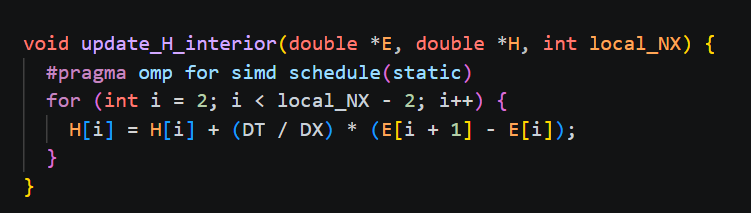
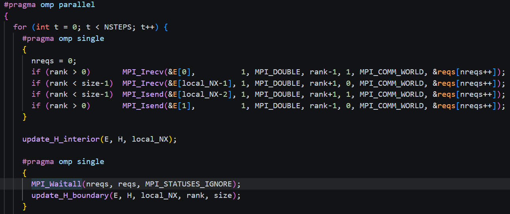
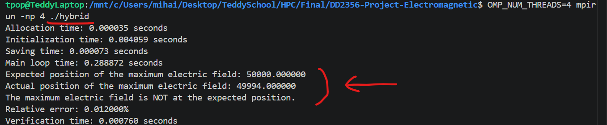
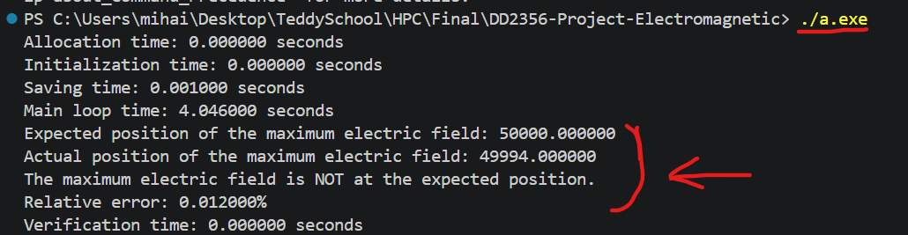

# Hybrid OpenMP + MPI

## Design and Implementation

The design for the hybrid OpenMP + MPI version was taken primarily from the design of the individual versions, with an added optimization regarding halo exchange. With now (N,P) threads and processes running the code in parallel, we increase the domain partitioning even further. Now, we have P processes take ownership for a portion of the large array, while the N threads running on each processes will further partition each process' array region. Individual threads for a process do not need to share their chunk boundary values as the overarching process array chunk is shared between them. 

However, similar to the MPI version, the different processes themselves do need to communicate their updated boundary values between each other, as they do not have access to the updates done to boundary values on other chunks. A halo exchange is implemented to have the processes share these values with each other, with the left and right most values of the allocated array for each process being allocated to store those halo values. 

The halo exchanged is altered from the pure MPI approach, as the halo exchange communication between processes now overlaps with the interior array processing for each process. This is possible due to the non-boundary values of the array not relying on the halo values, and so their processing can proceed without impact, while waiting for the receival of the neighboring processes halo values. This added change might allow for faster speedups when the computation per thread is still quite high, and the communcation overhead for halo values can be fully overlapped by the computation overhead.

## Verification

Verification was done similarly to the OpenMP and MPI versions. The peak detection was MPI_Gathered at rank 0 to find the gloval maximum, and when testing on the same NX and step counts, the peak index matced the sequential version on all (N,P) thread,process counts:

We also verified by running the hybrid code with plotting enabled, and when visualizing the plotting with our visualize.py script, we can see the correct splitting of the E field identically to the sequential version (plots are stored in plots/field_plot_hybrid and plots/field_plot_serial).

## Communication Modeling

The main communication overhead in our system comes from the halo exchange done by neighboring MPI processes, and from thread synchronization. The OpenMP communication overhead in the hybrid version is identical to the base OpenMP version, as we have on inter-thread communication cost. We do have thread synchonrization costs due to the pragma single blocks for the halo exchange and boundary computation, and for the two parallel for loops for the updating H and E field interior values. Each single block and for loop has an implicit barrier at exit where all threads must wait, and so for each time step, we incur two thread barriers for the two field interior value computations, and 4 thread barriers for the 4 pragma single blocks (a halo exchange and boundary computation for both H and E fields). OMP thread barrier overhead scales logarithmically with thread count, and so we have 6log(N) as our estimate for thread synchronization costs. 

The main communication overhead we have though is from the MPI halo exchange. For each neighboring processes, for both the H and E fields, we need to send and receive 2 halo values (only one for the process with rank 0 and rank # processes - 1), at each step. Therefore, at each step, for P processes, we have 4*(P-1) MPI_Irecv and    4*(P-1) MPI_Isend, for a total of 8*(P-1) MPI communications every time step.  

In total for each time step, for (N,P) threads and processes, we have a model of the communication costs of 8*(P-1) MPI_Isend/Irecv + 6log(N) thread barriers. This affects our scalability, because as we grow the process/thread count, the added domain segmentation benefit for comptuation performance gets smaller. Meanwhile, we have a linearly scaling process communicaiton overhead and a logarithmically scaling thread synchroniztion overhead, which past a certain (N,P) count, will start to dominate the added parallelization benefits and will degrade performance. This limits the upper level of our scalability that will still show performance improvement.

## Results

To see how the hybrid OpenMP + MPI code performs, we fixed our number of cores (N*P for N threads and P processes) to values of 2,4,8, and 16. On each total N * P, we tested a number of different <N,P> configurations to see which was optimal, and to observe any trends as we increased our N * P core total: 

<table style="font-size: 0.85em; width: auto; border-collapse: collapse;">
  <thead>
    <tr>
      <th style="border: 1px solid;">Total (N×P)</th>
      <th colspan="5" style="border: 1px solid;">Configs (N,P) → Strong Scaling Speedup</th>
    </tr>
  </thead>
  <tbody>
    <tr>
      <td style="border: 1px solid;"><strong>2</strong></td>
      <td style="border: 1px solid;">(2,1) → 1.02</td>
      <td style="border: 1px solid;">(1,2) → 1.96</td>
    </tr>
    <tr>
      <td style="border: 1px solid;"><strong>4</strong></td>
      <td style="border: 1px solid;">(4,1) → 0.60</td>
      <td style="border: 1px solid;">(1,4) → 3.25</td>
      <td style="border: 1px solid;">(2,2) → 2.03</td>
    </tr>
    <tr>
      <td style="border: 1px solid;"><strong>8</strong></td>
      <td style="border: 1px solid;">(8,1) → 0.34</td>
      <td style="border: 1px solid;">(1,8) → 4.33</td>
      <td style="border: 1px solid;">(4,2) → 0.92</td>
      <td style="border: 1px solid;">(2,4) → 3.58</td>
    </tr>
    <tr>
      <td style="border: 1px solid;"><strong>16</strong></td>
      <td style="border: 1px solid;">(16,1) → N/A</td>
      <td style="border: 1px solid;">(1,16) → 2.60</td>
      <td style="border: 1px solid;">(8,2) → 0.37</td>
      <td style="border: 1px solid;">(2,8) → 1.96</td>
      <td style="border: 1px solid;">(4,4) → 2.31</td>
    </tr>
  </tbody>
</table>

We can observe that for all of our fixed core totals - the optimal configuration was to maximize P and only have one thread for each process. Additionally, all the lowest performing configurations were those where only one process was active, with all of the parallelization coming from OpenMP threads. This points to the barriers present in the OpenMP sections being a dominant factor and outweighing the parallelization benefit. On the other hand, we see the large strong scaling benefits when increasing the number of processes, with a large speedup increase for all process counts when each only runs one thread. We still notice the slight impact of the MPI Halo exchange, as we see that increasing from (1,8) to (1,16), and from (2,4) to (2,8), while the performance is still better than a sequential execution, the speedup decreases following the process count increase. Overall, we notice that the OpenMP thread synchronization seems to outweigh the parallelism benefits, while the MPI domain segmentation is able to provide much large speedup benefits up to a certain point.